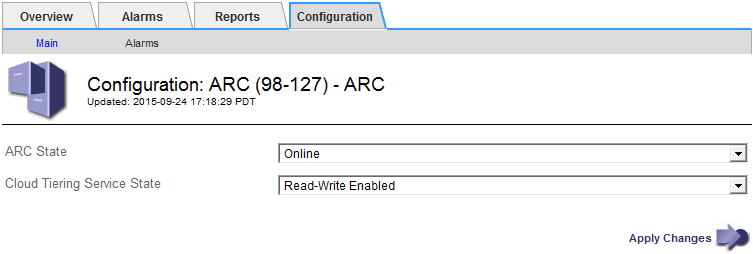

= 修改雲端分層服務狀態
:allow-uri-read: 
:icons: font
:imagesdir: ../media/

[role="lead"]
您可以變更Cloud Tiering Service的狀態、藉此控制歸檔節點讀取和寫入至透過S3 API連線的目標外部歸檔儲存系統的能力。

.開始之前
* 您必須使用登入Grid Manager link:../admin/web-browser-requirements.html["支援的網頁瀏覽器"]。
* 您有 link:admin-group-permissions.html["特定存取權限"]。
* 必須設定歸檔節點。

.關於這項工作
您可以將雲端分層服務狀態變更為*已停用讀寫*、有效地使歸檔節點離線。

.步驟
. 選取*支援*>*工具*>*網格拓撲*。
. 選擇「*歸檔節點_*>* ARC*」。
. 選擇*組態*>*主要*。
+

. 選取*雲端分層服務狀態*。
. 選取*套用變更*。

