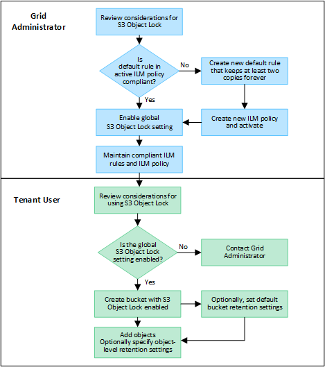

= S3物件鎖定的工作流程
:allow-uri-read: 
:icons: font
:imagesdir: ../media/

[role="lead"]
身為網格管理員、您必須與租戶使用者密切協調、以確保物件受到保護、並符合其保留需求。

工作流程圖顯示使用S3物件鎖定的高階步驟。這些步驟由網格管理員和租戶使用者執行。

== 網格管理員工作

如工作流程圖所示、網格管理員必須先執行兩項高層級工作、S3租戶使用者才能使用S3物件鎖定：

. 建立至少一個相容的 ILM 規則、並將該規則設為使用中 ILM 原則的預設規則。
. 為整個StorageGRID 支援系統啟用全域S3物件鎖定設定。

== 租戶使用者工作

啟用全域S3物件鎖定設定之後、租戶即可執行下列工作：

. 建立啟用S3物件鎖定的儲存區。
. 您也可以選擇指定貯體的預設保留設定。任何預設貯體設定只會套用至沒有其本身保留設定的新物件。
. 將物件新增至這些貯體、並選擇性地指定物件層級保留期間和合法保留設定。
. 視需要更新貯體的預設保留、或更新個別物件的保留期間或合法保留設定。

