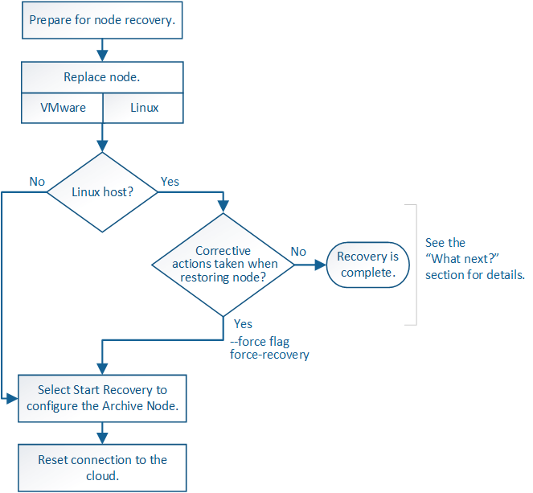

= 從歸檔節點故障中恢復：工作流程
:allow-uri-read: 
:icons: font
:imagesdir: ../media/

[role="lead"]
您必須準確完成一系列工作、才能從歸檔節點故障中恢復。

歸檔節點還原受下列問題影響：

* 如果ILM原則設定為複寫單一複本。
+
在設定為製作單一物件複本的物件系統中StorageGRID 、歸檔節點故障可能會導致無法恢復的資料遺失。如果發生故障、所有這類物件都會遺失；不過、您仍必須執行恢復程序、以「清理」 StorageGRID 系統、並從資料庫中清除遺失的物件資訊。

* 如果在儲存節點還原期間發生歸檔節點故障。
+
如果歸檔節點在儲存節點還原過程中處理大量擷取作業時失敗、 您必須重複此程序、從一開始就將物件資料的複本還原至儲存節點、以確保從歸檔節點擷取的所有物件資料都會還原至儲存節點。

