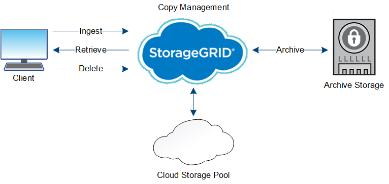

= 物件的壽命
:allow-uri-read: 
:icons: font
:imagesdir: ../media/

[role="lead"]
物件的生命週期由不同階段組成。每個階段都代表物件所執行的作業。

物件的壽命包括擷取、複本管理、擷取及刪除等作業。

* *內嵌*：S3或Swift用戶端應用程式透過HTTP將物件儲存至StorageGRID 該系統的程序。在這個階段StorageGRID 、這個物件的物件由整個系統開始管理。
* * 複製管理 * ：在 StorageGRID 中管理複寫和刪除編碼複本的程序、如使用中 ILM 原則中的 ILM 規則所述。在複本管理階段、StorageGRID 透過在儲存節點、雲端儲存資源池或歸檔節點上建立及維護指定數量和類型的物件複本、即可保護物件資料免於遺失。
* *擷取*：用戶端應用程式存取StorageGRID 由該系統儲存之物件的程序。用戶端會讀取從儲存節點、雲端儲存資源池或歸檔節點擷取的物件。
* *刪除*：從網格中移除所有物件複本的程序。物件可因用戶端應用程式傳送刪除要求至StorageGRID 該系統而刪除、或StorageGRID 是因物件壽命到期時執行的自動程序而刪除。

.相關資訊
* link:../ilm/index.html["使用ILM管理物件"]
* link:using-information-lifecycle-management.html["使用資訊生命週期管理"]

