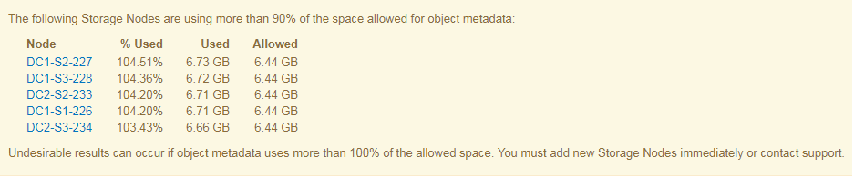

= 疑難排解中繼資料問題
:allow-uri-read: 
:icons: font
:imagesdir: ../media/

[role="lead"]
您可以執行數項工作、以協助判斷中繼資料問題的來源。

== 低中繼資料儲存警示

如果觸發*低中繼資料儲存*警示、您必須新增儲存節點。

.開始之前
* 您將使用登入Grid Manager link:../admin/web-browser-requirements.html["支援的網頁瀏覽器"]。

.關於這項工作
針對物件中繼資料、在每個儲存節點的Volume 0上保留一定的空間量。StorageGRID此空間稱為實際保留空間、可細分為允許用於物件中繼資料（允許的中繼資料空間）的空間、以及必要資料庫作業所需的空間、例如壓縮和修復。允許的中繼資料空間可控制整體物件容量。

image::../media/metadata_allowed_space_volume_0.png[中繼資料允許空間Volume 0]

如果物件中繼資料佔用的空間超過中繼資料所允許的 100% 、資料庫作業就無法有效執行、而且會發生錯誤。

您可以 link:../monitor/monitoring-storage-capacity.html#monitor-object-metadata-capacity-for-each-storage-node["監控每個儲存節點的物件中繼資料容量"] 協助您預測錯誤、並在錯誤發生之前予以修正。

下列Prometheus指標可用來測量允許的中繼資料空間是否已滿：StorageGRID

[listing]
----
storagegrid_storage_utilization_metadata_bytes/storagegrid_storage_utilization_metadata_allowed_bytes
----
當此Prometheus運算式達到特定臨界值時、會觸發*低中繼資料儲存*警示。

* *次要*：物件中繼資料使用70%以上的中繼資料空間。您應該盡快新增儲存節點。
* *主要*：物件中繼資料使用90%以上的允許中繼資料空間。您必須立即新增儲存節點。
+

CAUTION: 當物件中繼資料使用 90% 以上的允許中繼資料空間時、儀表板上會出現警告。如果出現此警告、您必須立即新增儲存節點。您絕不能允許物件中繼資料使用超過100%的允許空間。

* *重大*：物件中繼資料使用100%以上的允許中繼資料空間、開始耗用必要資料庫作業所需的空間。您必須停止擷取新物件、而且必須立即新增儲存節點。

在下列範例中、物件中繼資料使用超過100%的允許中繼資料空間。這是一種嚴重情況、會導致資料庫作業效率不彰及錯誤。

CAUTION: 如果Volume 0的大小小於中繼資料保留空間儲存選項（例如、在非正式作業環境中）、則*低中繼資料儲存*警示的計算可能不準確。

.步驟
. 選取*警示*>*目前*。
. 如有需要、請從警示表中展開*低中繼資料儲存*警示群組、然後選取您要檢視的特定警示。
. 檢閱警示對話方塊中的詳細資料。
. 如果已觸發重大或重大*低中繼資料儲存*警示、請執行擴充以立即新增儲存節點。
+

NOTE: 由於整個網格的中繼資料容量受限於最小網站的中繼資料容量、因此整個網格的所有物件中繼資料複本都會保留在每個網站上。StorageGRID如果您需要將中繼資料容量新增至單一站台、也應該如此 link:../expand/adding-grid-nodes-to-existing-site-or-adding-new-site.html["展開任何其他站台"] 儲存節點數量相同。

+
執行擴充之後StorageGRID 、將現有的物件中繼資料重新散佈到新節點、以增加網格的整體中繼資料容量。不需要使用者採取任何行動。*低中繼資料儲存*警示已清除。

== 服務：狀態 - Cassandra （ SVST ）警報

服務：狀態- Cassandra（SVST）警示表示您可能需要重建儲存節點的Cassandra資料庫。Cassandra是StorageGRID 做為中繼資料儲存區的用途。

.開始之前
* 您必須使用登入Grid Manager link:../admin/web-browser-requirements.html["支援的網頁瀏覽器"]。
* 您有 link:../admin/admin-group-permissions.html["特定存取權限"]。
* 您必須擁有 `Passwords.txt` 檔案：

.關於這項工作
如果Cassandra停止超過15天（例如、儲存節點已關閉）、則當節點重新連線時、Cassandra將不會啟動。您必須為受影響的DDS服務重新建置Cassandra資料庫。

您可以 link:../monitor/running-diagnostics.html["執行診斷"] 以取得有關網格目前狀態的其他資訊。

CAUTION: 如果兩個或更多 Cassandra 資料庫服務停機超過 15 天、請聯絡技術支援部門、不要繼續執行下列步驟。

.步驟
. 選取*支援*>*工具*>*網格拓撲*。
. 選擇*站台_*>*儲存節點_*>* SES*>*服務*>*警示*>*主*以顯示警示。
+
此範例顯示已觸發SVST警示。

+
image::../media/svst_alarm.gif[警示：SSM)：服務頁面]

+
「超音波即時監控服務」主頁也會指出Cassandra未在執行中。

+
image::../media/cassandra_not_running.gif[總覽：SSM)：服務頁面]

. [[Restart_Cassandra 、自 _the_Storage_Node] 請嘗試從儲存節點重新啟動 Cassandra ：
+
.. 登入網格節點：
+
... 輸入下列命令： `ssh admin@grid_node_IP`
... 輸入中所列的密碼 `Passwords.txt` 檔案：
... 輸入下列命令以切換至root： `su -`
... 輸入中所列的密碼 `Passwords.txt` 檔案：
當您以root登入時、提示會從變更 `$` 至 `#`。

.. 輸入： `/etc/init.d/cassandra status`
.. 如果Cassandra未執行、請重新啟動： `/etc/init.d/cassandra restart`

. 如果Cassandra未重新啟動、請判斷Cassandra已停機多久。如果Cassandra停機超過15天、您必須重建Cassandra資料庫。
+

CAUTION: 如果兩個或多個 Cassandra 資料庫服務中斷、請聯絡技術支援部門、請勿繼續執行下列步驟。

+
您可以透過記錄或檢閱servermanager.log檔案來判斷Cassandra停機的時間長度。

. 若要記錄Cassandra：
+
.. 選取*支援*>*工具*>*網格拓撲*。然後選擇*站台_*>*儲存節點_*>* SUS*>*服務*>*報告*>*圖表*。
.. 選擇*屬性*>*服務：狀態- Cassandra *。
.. 若為*開始日期*、請輸入至少比目前日期早16天的日期。若為*結束日期*、請輸入目前日期。
.. 按一下 * 更新 * 。
.. 如果圖表顯示Cassandra停機超過15天、請重建Cassandra資料庫。
+
下圖範例顯示Cassandra已停機至少17天。

+
image::../media/cassandra_not_running_chart.png[總覽：SSM)：服務頁面]

. 若要檢閱儲存節點上的servermanager.log檔案：
+
.. 登入網格節點：
+
... 輸入下列命令： `ssh admin@grid_node_IP`
... 輸入中所列的密碼 `Passwords.txt` 檔案：
... 輸入下列命令以切換至root： `su -`
... 輸入中所列的密碼 `Passwords.txt` 檔案：
當您以root登入時、提示會從變更 `$` 至 `#`。

.. 輸入： `cat /var/local/log/servermanager.log`
+
隨即顯示servermanager.log檔案的內容。

+
如果Cassandra停機超過15天、servermanager.log檔案會顯示下列訊息：

+
[listing]
----
"2014-08-14 21:01:35 +0000 | cassandra | cassandra not
started because it has been offline for longer than
its 15 day grace period - rebuild cassandra
----
.. 請確認此訊息的時間戳記是您依照步驟指示嘗試重新啟動Cassandra的時間 <<restart_Cassandra_from_the_Storage_Node,從儲存節點重新啟動Cassandra>>。
+
Cassandra可以有多個項目；您必須找出最近的項目。

.. 如果Cassandra停機超過15天、您必須重建Cassandra資料庫。
+
如需相關指示、請參閱 link:../maintain/recovering-storage-node-that-has-been-down-more-than-15-days.html["將儲存節點還原至停機時間超過15天"]。

.. 如果在 Cassandra 重建後仍未清除警報、請聯絡技術支援部門。

== Cassandra 記憶體不足錯誤（ SMTT 警報）

當Cassandra資料庫發生記憶體不足錯誤時、會觸發「事件總數」（SMT）警示。如果發生此錯誤、請聯絡技術支援部門以解決此問題。

.關於這項工作
如果Cassandra資料庫發生記憶體不足錯誤、就會建立堆傾印、觸發「事件總數（SMT）」警示、而Cassandra堆積記憶體不足錯誤數則遞增1。

.步驟
. 若要檢視事件、請選取*支援*>*工具*>*網格拓撲*>*組態*。
. 確認Cassandra堆積記憶體不足錯誤數為1或更高。
+
您可以 link:../monitor/running-diagnostics.html["執行診斷"] 以取得有關網格目前狀態的其他資訊。

. 前往 `/var/local/core/`、壓縮 `Cassandra.hprof` 歸檔、然後傳送給技術支援部門。
. 備份 `Cassandra.hprof` 檔案、然後將其從刪除 `/var/local/core/ directory`。
+
此檔案最大可達24 GB、因此您應該將其移除以釋放空間。

. 問題解決後、選取「 Cassandra 堆積記憶體不足錯誤」數的 * 重設 * 核取方塊。然後選取*套用變更*。
+

NOTE: 若要重設事件計數、您必須擁有 Grid 拓撲頁面組態權限。

