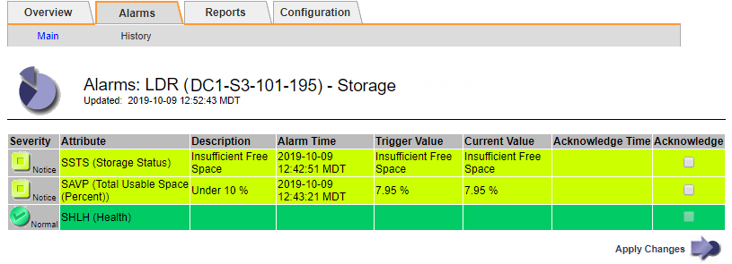

= 疑難排解儲存狀態（SSTS）警示
:allow-uri-read: 
:icons: font
:imagesdir: ../media/

[role="lead"]
如果儲存節點的可用空間不足、則會觸發儲存狀態（SSTS）警示、以供物件儲存之用。

.開始之前
* 您必須使用登入Grid Manager link:../admin/web-browser-requirements.html["支援的網頁瀏覽器"]。
* 您有 link:../admin/admin-group-permissions.html["特定存取權限"]。

.關於這項工作
當儲存節點中每個磁碟區的可用空間量低於儲存磁碟區軟式唯讀浮點（*組態*>*系統*>*儲存選項*）的值時、會在通知層級觸發SSTS（儲存狀態）警示。

image::../media/storage_watermarks.png[儲存選項總覽]

例如、假設Storage Volume Soft Read-Only Watermark設為10 GB、這是其預設值。如果儲存節點中的每個儲存磁碟區的可用空間少於10 GB、就會觸發SSTS警示。如果任何磁碟區有10 GB以上的可用空間、則不會觸發警示。

如果觸發了SSTS警示、您可以依照下列步驟來更深入瞭解問題。

.步驟
. 選取*支援*>*警示（舊版）*>*目前警示*。
. 從「服務」欄中、選取與SSTS警示相關的資料中心、節點和服務。
+
此時會出現「Grid拓撲」頁面。「警示」索引標籤會顯示所選節點和服務的作用中警示。

+

+
在此範例中、SSTS（儲存狀態）和SAVP（總可用空間（百分比））警示都已在通知層級觸發。

+

NOTE: 一般而言、SSTS警示和SAVP警示都會在大約相同時間觸發；不過、是否觸發這兩個警示取決於浮點設定（GB）和SAVP警示設定（百分比）。

. 若要判斷實際可用空間的大小、請選取* LTR*>* Storage*>* Overview *、然後尋找Total Available Space（STAS）屬性。
+
image::../media/storage_node_total_usable_space.png[可用空間總計]

+
在此範例中、此儲存節點上的164 GB空間只有19.6 GB可用。請注意、總計值是三個物件存放區磁碟區*可用*值的總和。觸發SSTS警示的原因是三個儲存磁碟區的可用空間均少於10 GB。

. 若要瞭解儲存設備長期使用的情形、請選取* Reports*索引標籤、然後繪製過去幾小時內的可用空間總計。
+
在此範例中、可用空間總計從12：00約155 GB降至12：35約20 GB、相當於觸發SSTS警示的時間。

+
image::../media/total_usable_space_chart.png[可用空間總計-圖表]

. 若要瞭解如何將儲存設備用作總容量的百分比、請繪製過去幾小時內的總可用空間（百分比）。
+
在此範例中、可用空間總計從95%下降至約10%以上。

+
image::../media/total_usable_storage_percent_chart.png[可用空間總計（百分比）-圖表]

. 視需要、 link:../expand/guidelines-for-adding-object-capacity.html["增加儲存容量"]。
+
另請參閱 link:../admin/managing-full-storage-nodes.html["管理完整儲存節點"]。

